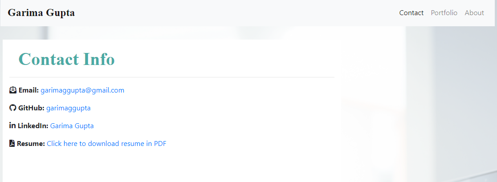

# React Portfolio
## **Create Resposive Portfolio Website using React**

As part of this homework, I developed Portfolio website using ReactJS and Bootstrap CSS Framework and grid layouts to create a mobile responsive portfolio. All webpages of this website use semantic HTML tags for better accessibility.

## Visuals

  

## Deployment Details

_Website is deployed on Github ([Repository link](https://github.com/garimaggupta/React_Portfolio)) and can be accessed via the following link_: [Garima's Portfolio](https://garimaggupta.github.io/React_Portfolio/)

## Notes

* Wesbite uses the following Tech Stack
  1. ReactJS
  2. React DOM Router
  3. Bootstrap CSS Framework
  4. Bootstrap Grid System (container, rows and columns)
